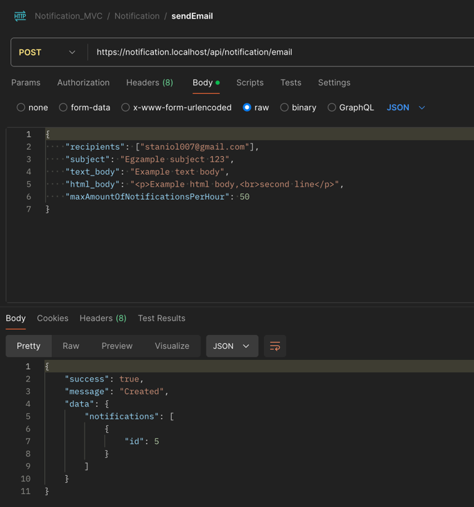

# Information:

* Author: Marcin Stanik

### 1. All API requests ( REST )
- https://transfer-go.localhost/api/notification
- https://transfer-go.localhost/api/notification/email
- https://transfer-go.localhost/api/notification/sms

save notifications in the database, function **NotificationService->storage()**

tables: 
- notification
- notification_recipient

### 2. every 1 minute CRON execute scrip:
* file: src/Command/NotificationProcessing.php
* cron: * * * * * /usr/local/bin/php /app/bin/console app:notification:processing
* Dockerfile line: 59

### 3. Scrip check if there are any notifications to send

* function **NotificationService->processing()**

### 4. If there are notifications to send, they are sent to RabbitMQ (AMQP)

* file: src/Service/NotificationService.php
* line: 127

### 5. RabbitMQ delegates sending notifications to consumers

### 6. RabbitMQ consumer

python bin/notificationConsumer.py

* is possible create **n** numbers of consumers
* file: frankenphp/docker-entrypoint.sh
* line: 74

### 7. Python script run PHP script: 

Python
* file: bin/notificationConsumer.py
* line: 17

### 8. PHP script is responsible for sending notifications

PHP:
* src/Command/NotificationSending.php
* sending function: **NotificationService->send()**

## Summary

There are 3 steps of sending notifications:
* storage
* processing
* send

####################


### 1. DOCKER

* docker compose down --remove-orphans
* docker compose build --no-cache
* SERVER_NAME="transfer-go.localhost" docker compose up -d --wait


* docker compose stop
* SERVER_NAME="transfer-go.localhost" docker compose up -d --wait

### 2. URL:

https://transfer-go.localhost/

### 3. configs:

- file: config/custom

### 4. API

#### 4.1. https://transfer-go.localhost/api/notification

```
curl --location 'https://transfer-go.localhost/api/notification' \
--header 'Content-Type: application/json' \
--data-raw '{
"recipients": [
{
"id": 1,
"name": "Marcin Stanik",
"email": "marcin.stanik@gmail.com",
"mobile": "+48609778584"
},
{
"id": 2,
"name": "Marcin Stanik 2",
"email": "staniol007@gmail.com",
"mobile": "+48609778584"
}
],
"subject": "Egzample subject 123",
"text_body": "Example text body",
"html_body": "<p>Example html body,<br>second line</p>",
"maxAmountOfNotificationsPerHour": 50,
"chanels": ["SMS", "EMAIL"]
}'
```

#### 4.2. https://transfer-go.localhost/api/notification/email

```
curl --location 'https://transfer-go.localhost/api/notification/email' \
--header 'Content-Type: application/json' \
--data-raw '{
"recipients": ["staniol007@gmail.com"],
"subject": "Egzample subject 123",
"text_body": "Example text body",
"html_body": "<p>Example html body,<br>second line</p>",
"maxAmountOfNotificationsPerHour": 50
}'
```

#### 4.3. https://transfer-go.localhost/api/notification/sms

```
curl --location 'https://transfer-go.localhost/api/notification/sms' \
--header 'Content-Type: application/json' \
--data '{
"recipients": ["+48609778510", "+48609778511", "+48609778512", "+48609778513", "+48609778514", "+48609778515", "+48609778516", "+48609778517", "+48609778518", "+48609778519"],
"text_body": "Example sms body",
"maxAmountOfNotificationsPerHour": 3
}'
```

### 5. MYSQL

* host: localhost:3312
* l: app
* p: !ChangeMe!

## 6. RabbitMQ

* config: config/custom/rabbitmq.yaml

## Screens


--



--


--


--


